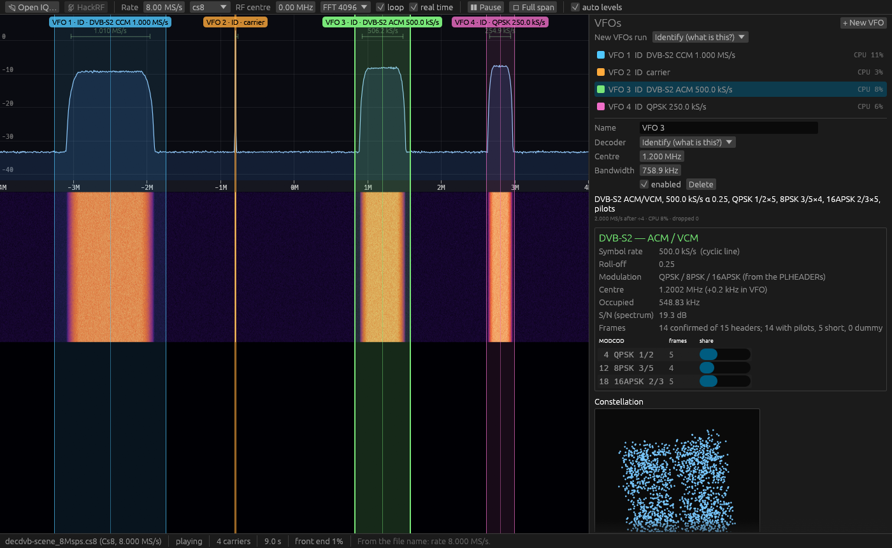

# DecDVB

A **DVB-S2 / DVB-S2X** receiver in Rust, for a **HackRF One** or recorded IQ,
built like **SDR++**: a big waterfall over the whole span, and VFOs you drop on
it, each running the decoder of your choice — including a blind **"what is
this?"** mode that finds a carrier's symbol rate and tells you what it is.

It decodes DVB-S2 and DVB-S2X with adaptive coding and modulation (**ACM**),
frame by frame: **GSE** to **IP** written as a PCAP, **MPEG-TS** to a file or
a media player, multicast radio played in the app.



*A synthetic 8 MS/s test scene (`decdvb scene`): a DVB-S2 CCM carrier, an
ACM carrier mixing S2 and S2X MODCODs (QPSK 1/2 → 8PSK 25/36 → 16APSK 26/45 →
32APSK 32/45), a DVB-S carrier and a CW tone (the scene has since gained a
TPC 2964 carrier). Every carrier was found and identified blind.*

> Early development. [`docs/DESIGN.md`](docs/DESIGN.md) holds the scope and the
> milestone plan, [`docs/STATUS.md`](docs/STATUS.md) what is done.

## What works now

| | |
|---|---|
| Waterfall + spectrum over the whole span, zoom and pan | ✅ |
| Carrier detection: every carrier marked with its symbol rate | ✅ |
| VFOs: draw, drag, resize, click a carrier to claim it; one thread each | ✅ |
| **Identify** — blind symbol rate, roll-off, constellation, DVB-S2/S2X detection | ✅ |
| DVB-S2/S2X PL demodulation: frame lock, MODCOD per frame (ACM) | ✅ |
| Carrier recovery: a locked constellation and MER, for Identify and DVB-S2 VFOs | ✅ |
| **DVB-S → MPEG-TS** (EN 300 421): code rate, rotation and inversion found blind; Viterbi, RS, the same TS outputs | ✅ |
| **TPC 2964 → IP / TS / voice** (Intelsat IESS-315 turbo product code, BPSK/QPSK): frame structure, scrambling and payload found from the signal; HDLC → IP, MPEG-TS, E1 and Comtech D&I++ voice | ✅ confirmed on a live Comtech CDM-600L carrier |
| **Q-Flex FastLink → data** (Paradise, QPSK 0.710): sync word, the (2880, 2048) LDPC code and the frame scrambler, all measured from a live carrier; inside, Paradise's closed-network + ESC framing and a 257-bit TDM multiplex (sixteen 8 kbit/s channels, metered live so speech shows) | ✅ decodes a live Q-Flex down to the multiplex (the voice codec not yet known) |
| **Viterbi K=7 → data** (IESS-308/309 SCPC and the like): rate 1/2–7/8, puncturing and orientation found blind and followed when the carrier turns; then the payload search — with or without differential decoding — for HDLC, TS, E1, D&I++, Paradise or IBS/SMS (IESS-309, 16/15) framing, or just the scrambler from the idle fill | ✅ decodes a live 10.24 kBd IESS-308 carrier to its IBS frames (rate 1/2, differential, V.35) |
| **Carrier ID (DVB-CID, ETSI TS 103 129)**: the spread-spectrum identifier under a carrier — the uplink modulator's unique ID (and MAC), position, telephone and text | ✅ to the specification, on synthetic carriers (no CID among the recordings yet) |
| **E1 voice**: G.704 E1 or Comtech Drop & Insert++ timeslots, G.711 A-law — levels per channel, listen, record `.wav` | ✅ |
| **Generic PSK/APSK/QAM → symbols** (`.bin`, one byte per symbol), BPSK…32APSK and 8/16/64QAM, for non-DVB carriers | ✅ |
| Narrow carriers: VFOs down to 500 Hz, ~10 kBd SCPC carriers lock | ✅ |
| IQ recorder and spectrum-only VFOs | ✅ |
| IQ file replay (`cs8`, `cs16`, `cf32`), rate/centre from file names | ✅ |
| **Live HackRF One**, 2–20 MS/s, pure Rust over USB (no DLLs), LNB LO | ✅ |
| **LDPC + BCH → BBFRAMEs**: all 21 S2 and 31 S2X codes, BBHEADER, stream info, payload rate | ✅ |
| **S2X**: 8-bit PLS code, all 55 normal/short MODCODs — 2+4+2 8APSK to 256APSK, the new interleavers | ✅ |
| **S2X VL-SNR**: the VL-SNR header, pi/2-BPSK (and spread), medium FECFRAMEs, all 9 MODCODs — down to about 0 dB Es/N0 so far | ✅ |
| PL scrambling: the preferred sequences of S2X Table 19e found from the pilots | ✅ |
| S2X superframing (Annex E) | to do |
| **GSE → IP → PCAP** + live IP stats; GSE variant detected from the data | ✅ |
| **MPEG-TS**: services, PIDs, errors; `.ts` file, UDP, TCP/HTTP to VLC or PotPlayer | ✅ |
| **TS analyser** (EBSPro-style): PIDs, services, now/next, network, tables | ✅ |
| **Multicast audio** from GSE or MPE: SAP/SDP names, codecs; unannounced RTP AAC and Opus described from their packets; IPv4 fragments reassembled; now-playing messages; play in the app (volume, pause) or VLC/PotPlayer; record to file | ✅ checked on a recording of a live MPE radio multiplex |
| Modulator (HackRF TX / IQ file) | M6 |

## Using it

```bash
cargo run --release -p decdvb-gui -- capture_8Msps.cs8
```

Or open a capture from the toolbar, or drop it on the window. The sample rate,
centre frequency and format are read from the file name when it carries them
(gqrx, SDR++ and DecDVB's own recordings do); otherwise set them in the toolbar.

On the waterfall:

| | |
|---|---|
| **wheel** | zoom about the cursor |
| **right- or middle-drag** | pan; past the span's edge (or at full span) with the HackRF live, it tunes the radio — the spectrum follows the mouse |
| **drag on empty space** | draw a new VFO |
| **double-click** | drop a VFO |
| **click a green bracket** | claim a detected carrier with a VFO sized to fit |
| **drag a VFO** / **its edge** | move it / resize it |
| **click** (VFO selected) | tune it there |
| **✕** on a VFO's label, or **Delete** | remove it |

The big readout at the top is the centre frequency, as in SDR++: wheel over a
digit or click its upper/lower half to step it, right-click to zero that digit
and every one below it. With the HackRF running it retunes the radio.

**📁 Output folder…** in the toolbar sets where IQ recordings, symbol files,
PCAP and TS files go (default `Documents\DecDVB`); it is remembered between
runs and applies to existing VFOs too.

The side bar lists the VFOs with their CPU load (✕ removes one), and shows the
selected one's settings, its Identify result or demodulator state (lock, MER,
residual offset), a carrier-locked constellation and a zoomed spectrum.

### DVB-S2 → GSE/IP → PCAP

A **DVB-S2/S2X → GSE/IP** VFO demodulates, decodes LDPC and BCH, and reads
the BBFRAMEs. Generic-stream frames go through GSE (ETSI TS 102 606) to IP,
fragments reassembled and their CRC-32s checked. The side bar shows the
stream, IP packet and byte counts, the IP rate, protocols and the busiest
flows; press **● Record** next to *PCAP* to write the packets to a `.pcap`
(raw IP, opens in Wireshark).

Real links do not all follow the standard. As in
[dontlookup](https://github.com/ucsdsysnet/dontlookup), DecDVB reads every
data field four ways at once — GSE_LENGTH counting the 2-byte header or not,
the fragment id as 8 bits or as 6 bits plus a 2-bit counter — and keeps
whichever yields valid IP (checksums, lengths). The *GSE* setting can force
one. If none yields IP, a blind IPv4 search over the data fields takes over.

### DVB-S2 → MPEG-TS → VLC / PotPlayer

A **DVB-S2/S2X → MPEG-TS** VFO rebuilds the transport stream from TS-mode
BBFRAMEs (sync bytes restored from the CRC-8 chain, deleted null packets put
back) and shows its services (from the PAT, PMT and SDT), PIDs, CRC and
continuity errors. Send it on with any of:

| | |
|---|---|
| **TS file → ● Record** | a `.ts` in the output folder |
| **UDP** `127.0.0.1:1234` | VLC: `udp://@:1234` · PotPlayer: `udp://127.0.0.1:1234` |
| **TCP / HTTP** `127.0.0.1:8001` | VLC or PotPlayer: `http://127.0.0.1:8001/` (VLC also `tcp://…`) |
| **▶ VLC / ▶ PotPlayer** | starts the TCP server and opens the stream in the player |

**🔍 TS analyser** opens a window in the spirit of EBSPro's: every PID with
what it is (PAT, PMT, H.264 video, AC-3 audio, ECM/EMM with the CA system,
unlisted PES…), the service it belongs to, its bitrate and share, continuity
and error counts, scrambling and PCR; the service tree with what is on now and
next (EIT); the network's transponders (NIT); and every table seen.

Both network outputs start on 127.0.0.1, this machine only; use 0.0.0.0 (TCP)
or another host's address (UDP) to reach the network. Several players can
connect to the TCP server at once; one that stalls loses data rather than
holding up the receiver.

### Multicast audio

Satellite links carry radio as IP multicast — in GSE, or in MPE inside a
transport stream (both are read). Any DVB-S2 IP or TS VFO lists the audio
streams it finds under **Multicast audio**: named from SAP/SDP announcements
where there are any, with codec (AAC in ADTS, LATM/LOAS or RFC 3640, MPEG
audio, PCM, Opus), bitrate and RTP payload type, listed by address.

Streams with no announcement are described from their own packets: RFC 3640
AAC by its RTP clock rate (from RTCP sender reports, else timed against the
signal), the clock ticks an access unit spans (1024: AAC-LC; 2048: HE-AAC)
and its first element (mono or stereo); Opus by packets that parse as Opus.
IPv4 fragments are put back together first — a multiplex packing several
AUs into a 2.3 kB RTP packet sends each as two. `<nowplaying>` messages
(title, artist, station) are listed under **Now playing**.

- **▶ Play** decodes it in DecDVB: MPEG audio layers I–III, AAC-LC (from
  ADTS, LATM/LOAS or RFC 3640), Opus (libopus) and PCM/G.711, with **⏸ Pause** (resumes
  live), **⏹ Stop**, a level meter, and the volume slider and 🔊 mute at the
  top of the list (app-wide, remembered). HE-AAC plays its AAC-LC core —
  band-limited; open it in VLC for the full sound.
- **⏺ Record** saves the stream to the output folder as broadcast, with no
  re-encoding: `.mp2`/`.mp3`, `.aac` (ADTS, any AAC carriage, HE-AAC intact),
  `.wav` for PCM, `.ts` for TS in UDP, `.opus` (Ogg) for Opus.
- **… → Open in VLC / PotPlayer**: an RTP stream with a description is
  relayed to a local port and the player is given an SDP file (so it decodes
  HE-AAC, LATM and the rest itself); a bare elementary stream is served at a
  local HTTP address.

After the
[VK2SWL DVB-S/S2 Multicast Audio Receiver](https://github.com/VK2SWL/DVB-S-S2-Multicast-Audio-Receiver).

### DVB-S → MPEG-TS

The older standard, still the norm for amateur DATV (QO-100) and some feeds.
The VFO finds the symbol rate as usual, locks the QPSK, then works out the
rest itself: the code rate (1/2 … 7/8), the puncturing phase, and the
carrier's 90° rotation and spectral inversion, by decoding a block under
each hypothesis and keeping the one whose re-encoding matches what was
received. Then Viterbi (K = 7, soft), the sync bytes, the convolutional
deinterleaver, Reed–Solomon (204,188) and energy dispersal — and the stream
goes to the same TS outputs and analyser as DVB-S2's.

### TPC 2964 → IP / MPEG-TS

The rate-3/4 turbo product code of Intelsat IESS-315 VSAT carriers, as the
CTCOM RCV-20x manual describes it: frames of 2964 bits, a 20-bit unique word
F50B8h and a (64,57) × (46,39) extended-Hamming product codeword holding 2223
data bits, with a (2, 3, 9, 12) / 475h scrambler. IESS-315 itself sets only
performance and leaves the code to "compatible turbo modems", so the VFO
finds the rest from the signal:

1. **Unique word** every 2964 bits, under each carrier phase ambiguity; a
   carrier slip or a lost symbol is repaired at the next frame.
2. **Frame structure**: row or column order, either way round, the Hamming
   generator (all six degree-6 primitive polynomials), whether and how the
   code bits are scrambled — 432 combinations, judged by how many rows *and*
   columns are codewords as received (near all under the right one, 1 in
   128 under any other); close calls are settled by decoding.
3. **Decoding**: iterative Chase–Pyndiah soft decoding.
4. **Payload**: HDLC (FCS-16/32) or MPEG-TS, under each candidate
   descrambler — the (2, 3, 9, 12) polynomial self-synchronising or additive,
   ITU-T V.35's and V.29's — whichever yields frames that check.

IP found in the HDLC frames (Cisco HDLC, PPP, or anything with the packet
after a short header) gets the same statistics, PCAP and multicast audio as
GSE; a transport stream gets the TS outputs. **● Record** also writes the
decoded data to a `.bin`. Identify recognises the carrier by its unique
word. What each search found is shown, so you can tell a finding from a
default. It is confirmed on synthetic carriers; a recording of a real one
would settle the details the documents leave open.

### Voice over E1 (G.704, Comtech D&I++)

Modems carrying telephony or radio links (airband voice, for one) send
64 kbit/s G.711 channels: a whole E1, or — Comtech's **Drop & Insert++** —
the chosen timeslots in frames of 2944 bits (64 overhead, 2880 data; the
layout is not published and was worked out from a CDM-600L carrier: a
24-bit header, then five blocks of 72 bytes each after 10 bits of
overhead). Behind the TPC 2964 decoder the payload search finds either,
under the V.35 descrambler or any other it tries, and the **Voice** card
lists the channels with their levels: **▶** listens (the app's player and
volume), **●** records a `.wav`. A timeslot whose sign bit never changes is
not G.711 audio — sub-rate channels or compressed voice, which played as
A-law is digital noise — and is marked **not G.711** with the bits that do
change. Offline:

```bash
decdvb decode capture_148148Sps.cf32 --decoder tpc --out dir --e1-record 1
```

### Carrier ID (DVB-CID)

Modern uplink modulators hide a carrier identification signal under their
carrier (ETSI TS 103 129): BPSK spread 4096 chips a bit, 27.5 dB below the
carrier's spectral density, 220 Hz above its centre, saying who transmits —
the modulator's 64-bit identifier (often its MAC address) and, if the
operator entered them, its position, a telephone number and a short text.
Put a **Carrier ID (DVB-CID)** VFO on a carrier (at least 1.35 × the chip
rate wide: 151 kHz below 512 kBd, 302 kHz above): it measures the carrier,
searches for the spreading code (a fraction of a second), then reads frames —
one every 36 s (18 s on carriers of 512 kBd and up). Its card shows the
tracking live — the despread bits and their differential products as
constellations (with MER), the early/prompt/late correlators on the code's
correlation peak, SNR and frequency over the last few seconds, the soft bits
and the frame sync filling copy by copy — and, under **Code search**, the
acquisition itself: correlation over the 4096 code phases, and code phase ×
frequency around the peak. Offline:

```bash
decdvb decode capture_1000000Sps.cf32 --decoder cid --fast
```

No CID to hand? `decdvb cid` writes one under a DVB-S2 carrier, with your
choice of identifier, position, telephone and text (see
[`tests/`](tests/README.md)).

### Generic PSK → symbols

For carriers that are not DVB-S2 — SCPC data, telemetry, DVB-S — a VFO locks
the carrier and shows its constellation; press **● Record** and it writes the
hard-decided symbols to
`decdvb-<VFO>-<freq>Hz-<rate>Bd-<modulation>-<time>.bin`, one byte per symbol:
the symbol's bit label under the DVB-S2 mapping (BPSK: 0 = +1). The symbol rate
and constellation come from Identify, or set them by hand. Without a preamble
the carrier phase is ambiguous by the constellation's symmetry (90° for QPSK),
so the labels may be a fixed rotation of the sent ones — a sync word found
offline resolves it.

**Text (live)**: the decided bits are also searched for readable strings,
under every phase rotation and mirror image, both bit orders, all eight byte
alignments, plain and differentially decoded — 256 readings at once for
QPSK. The reading with far more text than the rest is shown, scrolling as
the strings arrive (telemetry, beacons, NMEA, idle messages), with the
longest strings from any reading as candidates. Untick *look for text* to
save the CPU (about a quarter of a core at 1 MBd).

### Text in every decoder

Every decoder shows the text in what it decodes:

- **DVB-S2/S2X and DVB-S → MPEG-TS**: the transport stream's payloads, read
  per PID so a table's strings come out whole — service and provider names,
  EPG text, URLs, anything carried in the clear — and, when the stream
  carries IP (MPE), the IP payloads too.
- **DVB-S2/S2X → GSE/IP** and **TPC 2964 over HDLC**: the UDP/TCP payloads —
  SAP/SDP announcements, HTTP headers, plain-text protocols.
- **TPC 2964** whose payload is not recognised yet, **Identify** while it
  demodulates live, and the **generic PSK** decoder: every reading of the
  bits, as above.

Decoded data may be compressed, encrypted or video, which throws up short
printable runs by chance, so the byte decoders rank strings by how often
they recur (chance runs do not recur) and list long strings as they come.

### What Identify reports

It splits what it *knows* from what it *guesses*. **DVB-S2** is reported as a
fact — PLHEADERs found repeating exactly where their own PLS codes predict the
next frame — with the MODCODs in use, pilots, frame lengths, and CCM vs ACM.
Anything else gets measurements (symbol rate, roll-off, an estimated
constellation) and a labelled guess: plain QPSK reads *"possibly DVB-S (not
verified)"* (the DVB-S decoder confirms it), and a BPSK or QPSK carrier with
the TPC 2964 unique word every 2964 bits is named as such. For the rest it
looks for fingerprints of proprietary waveforms:

- **DVB-S2-style headers off their own grid**: SOF and PLS headers that recur
  regularly but not where their PLS codes say the next frame starts — S2
  framing whose codes mean something else, as NovelSat NS3/NS4 appear to use
  (their manuals describe S2-style headers, S2 frame sizes and Gold-code
  scrambling, with extra code rates) or a vendor's short frames.
- **A 2 % roll-off**, sharper than DVB-S2X's 5 % — NovelSat NS4's.
- **Frame structure**: any symbols that repeat frame after frame (a header,
  unique word or pilots) show up in the autocorrelation of the locked
  symbols; Identify reports the period and, given enough frames, where the
  repeating symbols sit (*"repeats every 3330 symbols; 162 known symbols: 90
  from 0, then 2 blocks of 36 every 1476"*) — a fingerprint of a framing even
  when no specification is public.

Comtech VersaFEC and the TPC/LDPC modes of SCPC modems publish no sync
word or frame layout, so they can only be recognised by such measurements;
captures of them would let DecDVB name them. Paradise FastLink was worked
out that way from a capture of a Q-Flex (QPSK 0.710): Identify names it, and
the **Q-Flex FastLink** decoder decodes it. A carrier too slow to show three frames in the first look is marked
*provisional* while it listens longer. Between identifications it keeps
demodulating with what it found, so the constellation and MER stay live.

### Command line

```bash
decdvb scan capture_8Msps.cs8     # find every carrier and identify each
decdvb scene                      # write the 8 MS/s test scene above
decdvb cid                        # a DVB-S2 carrier with a DVB-CID under it
decdvb test-signals tests         # both, into tests/ (see tests/README.md)
decdvb mcast recording.ts --decode --record out   # the radio in a .ts (MPE)
decdvb modcods                    # the DVB-S2 MODCOD table
```

## Build

Rust 1.95 or newer, a C compiler and CMake (libopus, for Opus radio, is
built from the `third_party/opus` submodule):

```bash
git clone --recurse-submodules https://github.com/CasualArclamp/DecDVB
cargo build --release
```

In an existing clone, `git submodule update --init` fetches libopus.

### HackRF One

Click **📡 HackRF** in the toolbar, set the frequency, sample rate and gains,
and **Start**. Frequency and gains apply live. **LNB LO** only labels the axis
(RF = tuned + LO): 10700 MHz by default (a universal Ku LNB's high band),
9750 MHz for its low band or QO-100, 0 without one.

The driver is pure Rust over USB ([`seify-hackrfone`](https://crates.io/crates/seify-hackrfone)
on `nusb`): no libhackrf, no libusb, nothing to install beyond the WinUSB driver
the HackRF already uses on Windows (Zadig, or the official tools). DecDVB only
ever **receives**, and keeps the antenna-port power **off** — feed an LNB from
an external inserter.

**DC removal** (toolbar, on by default) subtracts the IQ mean before the
waterfall and the VFOs, which removes the spike the HackRF leaves at the
centre frequency. Its notch is a few hertz wide.

## Scope

Everything one HackRF One can carry: symbol rates to roughly 15 MS/s, normal /
short / medium FECFRAMEs, all DVB-S2 and S2X MODCODs up to 256APSK, VL-SNR with
pi/2-BPSK, roll-offs 0.35 down to 0.05, superframing (Annex E), multistream
(ISI) and the gold-code index. Channel bonding (Annex D) and wideband
time-slicing (Annex M) are out of scope — they need more spectrum than one
HackRF has. Wide broadcast transponders (27–45 MS/s) exceed the HackRF's USB
throughput, so those are handled from recorded IQ only.

## Credits

Written from ETSI **EN 302 307-1** (DVB-S2) and **EN 302 307-2** (DVB-S2X), with
algorithms studied from and credited to:

- [gr-dvbs2rx](https://github.com/igorauad/gr-dvbs2rx) (GPL-3) — PL framing,
  frame sync, LDPC/BCH
- [leansdr / leandvb](https://github.com/pabr/leansdr) (GPL-3) — constellations
- [gr-dtv](https://github.com/gnuradio/gnuradio) (GPL-3) — modulator reference
- [dontlookup](https://github.com/ucsdsysnet/dontlookup) (MIT) — GSE/IP
  de-encapsulation, including the proprietary header-length and split
  fragment-ID variants found on real carriers
- DecDRM — the waterfall's GPU ring texture

## Licence

GPL-3.0-or-later. See [LICENSE](LICENSE).
